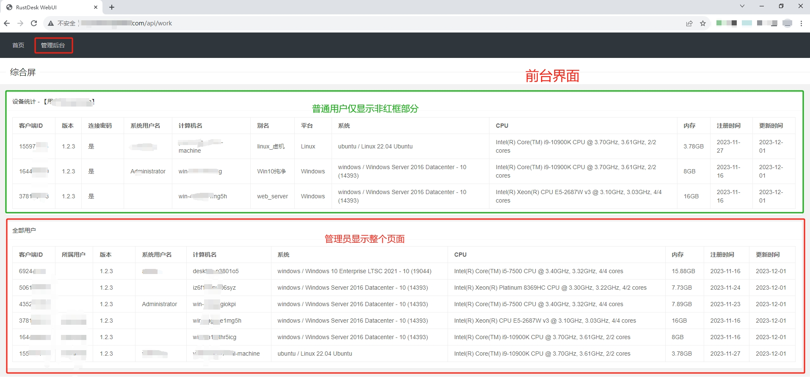
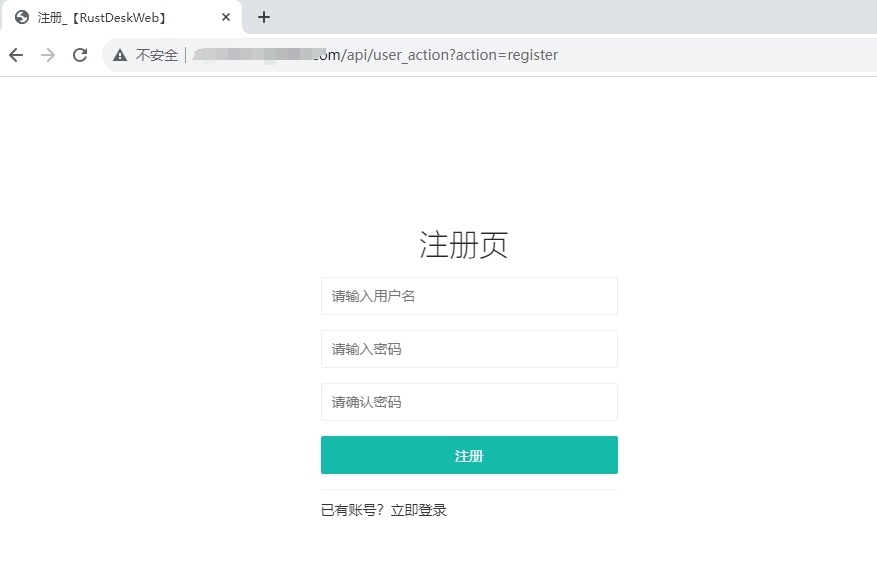
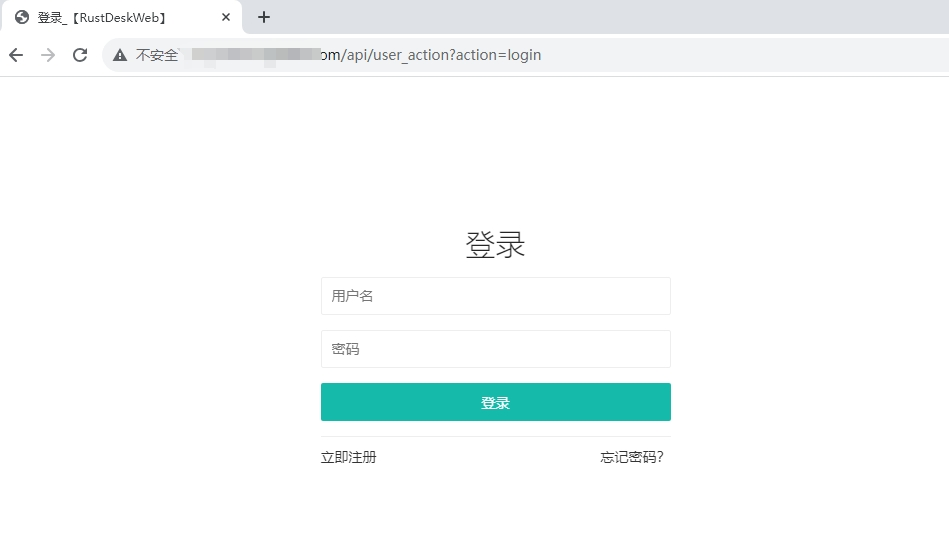
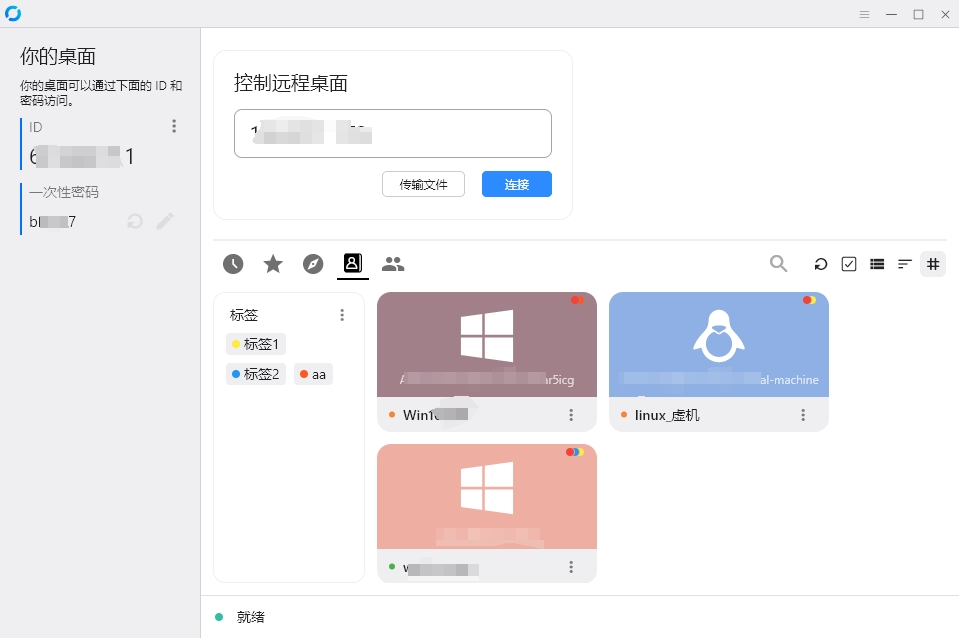

# rustdesk-api-server

<p align="center">
    <i>一个 python 实现的 Rustdesk API 接口，支持 WebUI 管理</i>
    <br/>
    
    
    
    <br/>
    
    
</p>

## 缘起

看了市面上各类 RustDesk WEB API 版本，或多或少的存在一些问题，比如说，需要通过url注册、新版客户端某些接口不支持、无法方便的修改密码等不足，因此博采众长，撸一个自己喜欢的版本来用。在此要感谢论坛及github的各位朋友写的接口，省去了我抓包找接口的时间。



## 功能特点

 - 支持前台网页自主注册和登录。
   - 注册页与登录页：





 - 支持前台展示设备信息，分为管理员版、用户版。
 - 支持自定义别名（备注）。
 - 支持后台管理。
 - 支持彩色标签。



 - 支持设备在线统计。
 - 支持设备密码保存。
 - 利用心跳接口自动管理token并保活。
 - 支持分享设备给其他用户（本功能暂未实现）。

后台主页：


## 安装

### 开箱即用

仅支持Windows，请前往 release 下载，无需安装环境，直接运行`启动.bat`即可。独立版截图：


### 代码运行

```bash
# 将代码克隆到本地
git clone https://github.com/kingmo888/rustdesk-api-server.git
# 进入目录
cd rustdesk-api-server
# 安装依赖
pip install -r requirements.txt
# 确保依赖安装正确后，执行：
# 端口号请自行修改，建议保留21114为Rustdesk API默认端口
python manage.py runserver 0.0.0.0:21114
```

此时即可使用 `http://本机IP:端口` 的形式来访问。

**注意**：如果 CentOS 配置时，Django4 会因为系统的 sqlite3 版本过低而出问题，请修改依赖库中的文件。路径：`xxxx/Lib/site-packages/django/db/backends/sqlite3/base.py` （根据情况自行查找包所在地址），修改内容:
```python
# from sqlite3 import dbapi2 as Database   #(注释掉这行)
from pysqlite3 import dbapi2 as Database # 启用pysqlite3
```

### Docker 运行

#### 自行构建
```bash
git clone https://github.com/kingmo888/rustdesk-api-server.git
cd rustdesk-api-server
docker compose --compatibility up --build -d
```
感谢热心网友 @ferocknew 提供。

#### 预构建运行

docker run 命令：

```bash
docker run -d \
  --name rustdesk-api-server \
  -p 21114:21114 \
  -e HOST=0.0.0.0 \
  -e TZ=Asia/Shanghai \
  -e CSRF_TRUSTED_ORIGINS=http://yourdomain.com:21114 \ #修改CSRF_TRUSTED_ORIGINS为你的访问地址
  -v /yourpath/db:/rustdesk-api-server/db \ #修改/yourpath/db为你宿主机数据库挂载目录
  -v /etc/timezone:/etc/timezone:ro \
  -v /etc/localtime:/etc/localtime:ro \
  --network bridge \
  --restart unless-stopped \
  ghcr.io/kingmo888/rustdesk-api-server:master
```

docker-compose 方式：

```yaml
version: "3.8"
services:
  rustdesk-api-server:
    container_name: rustdesk-api-server
    image: ghcr.io/kingmo888/rustdesk-api-server:master
    environment:
      - HOST=0.0.0.0
      - TZ=Asia/Shanghai
      - CSRF_TRUSTED_ORIGINS=http://yourdomain.com:21114 #修改CSRF_TRUSTED_ORIGINS为你的访问地址
    volumes:
      - /yourpath/db:/rustdesk-api-server/db #修改/yourpath/db为你宿主机数据库挂载目录
      - /etc/timezone:/etc/timezone:ro
      - /etc/localtime:/etc/localtime:ro
    network_mode: bridge
    ports:
      - "21114:21114"
    restart: unless-stopped
```
## 使用问题

- 管理员设置

  当数据库中不存在账户时，第一个注册的账户直接获取超级管理员权限，之后注册账户为普通账户。

- 设备信息

  经测试，客户端会在非绿色版模式下，安装为服务的模式中，定时发送设备信息到api接口，所以如果想要设备信息，需要安装rustdesk客户端并启动服务。

- 连接速度慢

  新版本Key模式链接速度慢，可以在服务端启动服务时，不要带参数的-k，此时，客户端也不能配置key。

## 开发计划

- [-] 分享设备给其他已注册用户

  > 说明：类似网盘url分享，url激活后可以获得某个或某组或某个标签下的设备
  > 备注：其实web api作为中间件，可做的不多，更多功能还是需要修改客户端来实现，就不太值当了。

- [ ] 集成Web客户端形式

  > 将大神的web客户端集成进来（待议）
